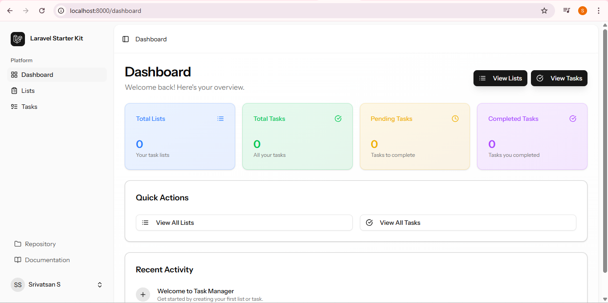
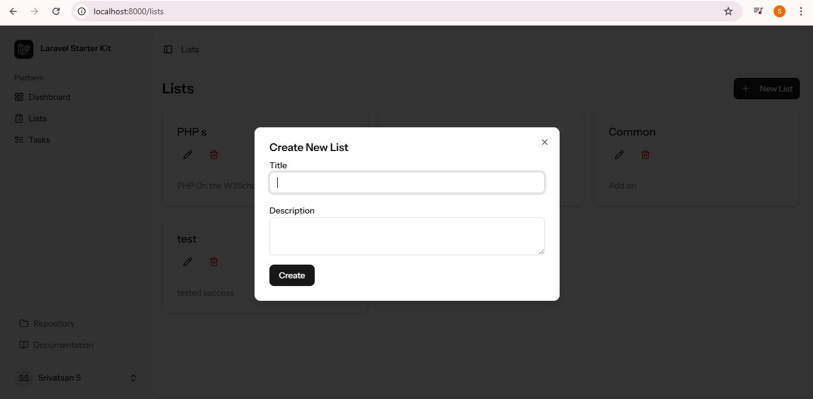
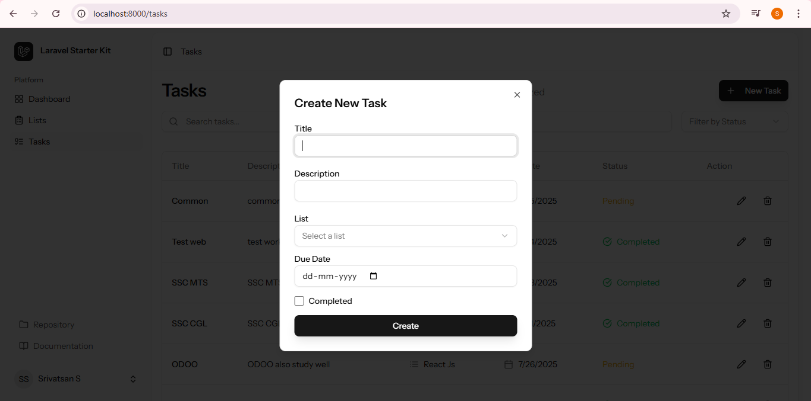

# Task Manager - Laravel 12 + Inertia + React

A clean, practical **Task Manager** application built using:

- **Laravel 12** (Backend, API)
- **Inertia.js + React** (Frontend)
- **Tailwind CSS + Lucide Icons** (Styling)

---

## ✨ Features

✅ User Authentication (Login, Register)  
✅ Create, Edit, Delete **Task Lists**  
✅ Add, Edit, Delete **Tasks** within lists  
✅ Mark tasks as **completed**  
✅ Dynamic **Dashboard with stats**:
- Total Lists
- Total Tasks
- Completed Tasks
- Pending Tasks

✅ Mobile responsive layout  
✅ Clean component-based structure for easy extension

---

## 📸 Screenshots

### 🖥️ Dashboard Overview


### 🗂️ List View


### ✅ Task View



---

## 🚀 Installation

1️⃣ **Clone the repository:**
```bash
git clone https://github.com/YOUR-USERNAME/Todo_List_In_Laravel12.git
cd Todo_List_In_Laravel12


2️⃣ Install PHP dependencies:
```bash
composer install

3️⃣ Install Node dependencies:
```bash
npm install


